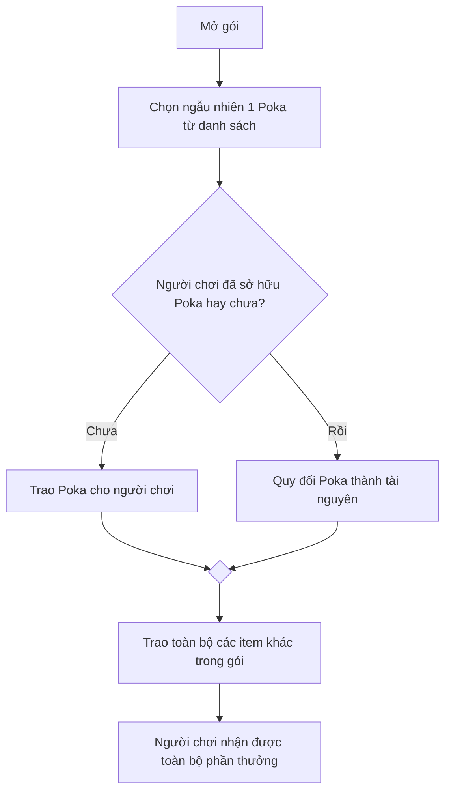

THIẾT KẾ NỘI DUNG GÓI IAP POKA
===

- **Phiên bản:**
- **Phạm vi:** Thiết kế khung nội dung cho 2 gói mua trong game (IAP) liên quan đến Poka.
---
# 1. Tổng quan

Tài liệu này thiết kế 2 loại gói:

- **Gói 1:** Người chơi nhận chắc chắn 1 Poka đã được hiển thị trước.
- **Gói 2:** Người chơi nhận 1 Poka ngẫu nhiên cùng các tài nguyên khác.

Tài liệu chỉ xác định cấu trúc và quy tắc hoạt động của gói. Giá bán, Poka cụ thể, danh sách Poka, tỉ lệ xuất hiện và số lượng tài nguyên cuối cùng sẽ do các bên liên quan quyết định.

---
# 2. Mục tiêu thiết kế

## 2.1. Gói 1

- Cho phép người chơi mở khóa sớm 1 Poka hiếm nằm ở tiến trình xa.
- Người chơi biết chính xác Poka sẽ nhận.
- Tạo giá trị từ sự chắc chắn và khả năng mở khóa sớm.

## 2.2. Gói 2

- Tạo cảm giác khám phá bất ngờ khi mở rương và nhận được Poka ngẫu nhiên theo hệ.
- Cung cấp thêm tài nguyên phục vụ lối chơi chính (core gameplay) match-3.
- Bảo đảm gói vẫn có giá trị khi người chơi nhận Poka trùng (đã sở hữu).

---
# 3. Gói 1 – Đảm bảo nhận Poka hiếm

## 3.1. Nội dung gói

| Thành phần          | Nội dung             |
| :------------------ | -------------------- |
| Phần thưởng chính   | 1 Poka được chỉ định |
| Hình thức nhận      | Nhận chắc chắn       |
| Poka hiển thị trước | Có                   |
| Tài nguyên khác     | Không có             |
| Giới hạn mua        | 1 lần                |

> Poka là giá trị chính của gói. Gói không chứa các tài nguyên khác.

## 3.2. Điều kiện hiển thị

Gói chỉ xuất hiện khi:

- Người chơi đã mở khóa hệ thống sưu tập Poka.
- Người chơi chưa sở hữu Poka đang được bán.
- Người chơi chưa đạt đến mốc tiến trình (game progress) có thể nhận Poka đó.
- Người chơi chưa từng mua gói.

Sau khi người chơi mua hoặc sở hữu Poka bằng nguồn khác, gói phải biến mất.

Poka vẫn có thể được nhận miễn phí về sau thông qua tiến trình game. Không quảng bá Poka là nội dung độc quyền trả phí.

---
## 3.3. Biểu tượng trên màn hình chính (HomeScreen Icon)

Sử dụng __hình Poka cụ thể mà người chơi sẽ nhận__ làm hình ảnh chính.

Biểu tượng gồm:

- Chân dung hoặc nửa thân trên của Poka.
- Khung theo hệ hoặc độ hiếm của Poka.
- Dấu hiệu trực quan (signature) thể hiện đây là Poka được nhận chắc chắn.
- Nhãn "Mới" khi người chơi chưa xem gói.

Không hiển thị đồng hồ đếm ngược.

Khi nhấn vào biểu tượng, mở trực tiếp cửa sổ mua.

---
## 3.4. Banner trong Shop

Banner tập trung vào Poka, không chia thành nhiều ô phần thưởng.

Nội dung hiển thị:

- Hình Poka lớn.
- Tên Poka
- Nhãn "Nhận chắc chắn".
- Nhãn "Mở khóa sớm".
- Giá bán

Khi nhấn vào banner, mở cửa sổ mua.

---
## 3.5. Pop-up Gói 1

Cửa sổ mua hiển thị:

- Tên gói
- Hình Poka lớn
- Tên Poka
- Hệ của Poka.
- Kỹ năng chính và mô tả ngắn.
- Nút xem chi tiết Poka.
- Nhãn "Nhận chắc chắn Poka này".
- Nhãn "Mở khóa ngay".
- Nút xem chi tiết Poka.
- Giá bán
- Nút mua
- Nút đóng

---
## 3.6. Quy tắc mua

- Mỗi người chơi chỉ được mua gói một lần duy nhất.
- Sau khi mở gói và sở hữu Poka, gói phải được ẩn đi (không hiển thị lại).

---
# 4. Gói 2 – Rương Poka bí ẩn theo hệ

## 4.1. Nội dung gói

| Slot | Nội dung                                                                         |
| :--- | -------------------------------------------------------------------------------- |
| 1    | 1 Poka ngẫu nhiên từ danh sách được cấu hình theo hệ của rương                   |
| 2    | Gold Coin. Số lượng phụ thuộc vào giá bán.                                    |
| 3    | In-game Booster (Hammer, Arrow, Cannon và Jester Hat)                            |
| 4    | Unlimited Pre-level Booster (Rocket, TNT, Light Ball) trong một khoảng thời gian |
| 5    | Unlimited Lives trong một khoảng thời gian                                       |

Danh sách Poka có thể nhận chỉ gồm các Poka cùng hệ với hệ của rương.

Các nhóm tài nguyên khác được tách riêng để người chơi dễ phân biệt giữa Poka nhận ngẫu nhiên và phần thưởng cố định.
_(Cấu trúc này tham khảo Royal Match phân nhóm Gold Coin, In-game Booster, Pre-level Booster và Unlimited Lives trong các gói hỗn hợp)._

---
## 4.2. Điều kiện hiển thị

- Người chơi đã mở khóa hệ thống Poka.
- Người chơi chưa từng mua gói.

---
## 4.3. Quy trình nhận thưởng

---
## 4.5. Xử lý Poka trùng (đã sở hữu)

Nếu người chơi mở trúng Poka đã sở hữu, Poka được quy đổi thành các tài nguyên khác.

Bảng quy đổi cần xác định:

- Loại tài nguyên nhận được.
- Số lượng tài nguyên.
- Poka nào tương ứng với mức quy đổi đó.

Phần thưởng quy đổi phải được hiển thị tách biệt với các phần thưởng cố định của gói.

Số lượng quy đổi không được xác định trong tài liệu này và cần được cân bằng dựa trên giá trị của Poka.

---
# 4.6. Biểu tượng trên màn hình chính (HomeScreen Icon)

Sử dụng __rương theo hệ Poka__ làm hình ảnh chính.

Biểu tượng bao gồm:

- Hình rương
- Màu sắc đại diện cho hệ.
- Biểu tượng hệ trên mặt trước hoặc khóa rương.
- Dấu hiệu nhận diện liên quan đến Poka (signature).
- Nhãn "Mới" khi người chơi chưa xem gói.

Khi nhấn vào biểu tượng, mở trực tiếp cửa sổ mua.

---
# 4.7. Banner trong Shop

Banner hiển thị:

- Hình rương theo hệ.
- Tên gói.
- Slot Poka bí ẩn (Silhouette).
- Gold Coin.
- In-game Booster.
- Pre-level Booster.
- Unlimited Lives.
- Giá bán.

Slot Poka phải có kích thước lớn hơn các slot còn lại.

Khi nhấn vào banner, mở cửa sổ mua của gói.

---
# 4.8. Pop-up Gói 2

Cửa sổ mua được chia thành 3 khu vực.

### Khu vực 1 – Poka bí ẩn

Hiển thị:

- Hình rương theo hệ.
- Hình bóng (Silhouette) của Poka.
- Biểu tượng hệ.
- Dòng "Chắc chắn nhận 1 Poka hệ [Tên hệ]".
- Dòng "Poka nhận được là ngẫu nhiên".
- Nút thông tin `i`.

Slot Poka phải là phần nổi bật nhất của cửa sổ.

### Khu vực 2 – Phần thưởng cố định

Hiển thị 4 slot:

| Slot | Nội dung hiển thị                                                                 |
| :--- | --------------------------------------------------------------------------------- |
| 2    | Icon và số lượng Gold Coin                                                        |
| 3    | Icon và số lượng từng In-gam Booster (Hammer, Arrow, Cannon, Jester Hat)          |
| 4    | Icon Unlimited Pre-level Booster (Rocket, TNT, Light Ball) cùng thời gian sử dụng |
| 5    | Icon Unlimited Lives hạn cùng thời gian sử dụng                                   |

Slot 4 và 5 sử dụng unlimited icon và đồng hồ thể hiện thời gian sử dụng tài nguyên.

### Khu vực 3 – Giao dịch

Hiển thị:

- Giá bán.
- Nút mua.
- Nút đóng.

---

## 4.9. Bảng thông tin Poka

Khi người chơi nhấn nút `i` tại Slot 1, mở bảng thông tin gồm:

*Ví dụ:*

| Poka   | Hệ   | Tỷ lệ |
| ------ | ---- | ----: |
| Poka A | Nước |    X% |
| Poka B | Nước |    X% |
| Poka C | Nước |    X% |

### Danh sách Poka (3 Poka)

Mỗi Poka hiển thị:

- Hình ảnh
- Tên
- Hệ
- Tỷ lệ nhận.

Tổng tỷ lệ của toàn bộ danh sách phải bằng 100%.

### Quy tắc nhận thưởng

Hiển thị rõ:

- Mở rương chắc chắn nhận một Poka ngẫu nhiên theo hệ.
- Poka được chọn ngẫu nhiên từ danh sách của rương.
- Các tài nguyên tại Slot 2, 3, 4 và 5 luôn được nhận.

### Quy tắc Poka trùng (đã sở hữu)

Hiển thị:

- Loại tài nguyên quy đổi
- Số lượng quy đổi

---
## 4.10. Quy tắc mua

- Mỗi người chơi chỉ được mua gói 1 lần.
- Sau khi mua thành công, icon và banner của gói được ẩn.

---

# 5. Quy tắc liên kết giữa hai gói

- Poka đang được bán trong __Gói 1__ không xuất hiện trong _danh sách Poka ngẫu nhiên_ của __Gói 2__ trong cùng thời gian.
- **Gói 1** tập trung vào Poka cụ thể và khả năng mở khóa sớm.
- **Gói 2** tập trung vào yếu tố bất ngờ và tổng giá trị của toàn bộ phần thưởng.

---

# 6. Cấu hình cần thiết

## 6.1. Gói 1

| Trường dữ liệu     | Nội dung                                         |
| :----------------- | ------------------------------------------------ |
| Mã gói             | ID của gói                                       |
| Poka được bán      | ID Poka                                          |
| Giới hạn mua       | 1 lần                                            |
| Điều kiện hiển thị | Chưa sở hữu Poka và chưa đạt mốc mở khóa Poka đó |

## 6.2. Gói 2

| Trường dữ liệu              | Nội dung                       |
| :-------------------------- | ------------------------------ |
| Mã gói                      | ID gói                         |
| Danh sách Poka              | ID danh sách Poka              |
| Gold Coin                   | Số lượng tùy thuộc vào giá bán |
| In-game Booster             | Số lượng mỗi loại              |
| Unlimited Pre-level Booster | Thời gian sử dụng              |
| Unlmited Lives              | Thời gian sử dụng              |
| Quy đổi Poka trùng          | ID bảng quy đổi                |
| Giới hạn mua                | 1 lần                          |

---

# 7. QA Test

## 7.1. Gói 1

- Gói không hiển thị khi người chơi chưa mở khóa hệ thống Poka.
- Gói biến mất nếu người chơi sở hữu Poka từ nguồn khác.
- Gói biến mất nếu người chơi đạt mốc progression không còn đủ điều kiện mở khóa sớm.
- Người chơi không thể mua lần thứ hai.
## 7.2. Gói 2

- Tổng tỷ lệ Poka trong danh sách bằng 100%.
- Poka nhận thực tế đúng với danh sách và tỷ lệ cấu hình.
- Người chơi chỉ được mua một lần.
- Slot 2–5 vẫn được nhận đầy đủ trong cả trường hợp Poka mới và Poka trùng.
- Unlimited Booster/Lives kích hoạt và tính thời gian đúng rule.
- Sau khi mua, icon và banner biến mất.

---
# 8. Ngoài phạm vi tài liệu

Tài liệu này không quyết định:

- Giá bán của hai gói.
- Poka cụ thể trong Gói 1.
- Danh sách Poka trong từng rương.
- Tỉ lệ nhận của từng Poka.
- Số lượng Gold Coin và vật phẩm.
- Thời lượng của các phần thưởng không giới hạn.
- Giá trị quy đổi khi nhận Poka trùng.
- Kỹ năng của Poka.
- Hình ảnh và bố cục art cuối cùng.

---

